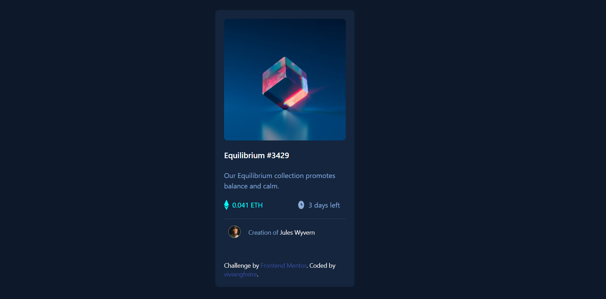

# CARD component

Essa foi a minha solução para o [NFT preview card component challenge on Frontend Mentor](https://www.frontendmentor.io/challenges/nft-preview-card-component-SbdUL_w0U) utilizando Tailwind.

## Visualização

### Foto da tela

## Meu processo

### Construído com

- HTML5
- Tailwind CSS
- Flexbox

### Aprendizado contínuo

Projeto feito com o intuito de exercitar HTML5 e Tailwind e me desafiar a achar a resolução dos problemas. Foi meu primeiro projeto utilizando Tailwind, um aprendizado enorme. Sinto que a prática traz muito mais aprendizado que a teoria, por isso é importante para mim estar constantemente me desafiando. 

### Fontes úteis

- [W3 Schools](https://www.w3schools.com) - Essa fonte me ajuda muito a aprender as documentações do HTML. Ensinando com exemplos práticos.
- [Tailwind](https://tailwindcss.com) - Site com documentação de Tailwind.

## Autora

- GitHub - [vivian-gfreire](https://github.com/viviangfreire)
- LinkedIn - [viviangfreire](www.linkedin.com/in/vivian-gfreire)

# Guia de estilização do projeto

## Colors

### Primary

- Soft blue: hsl(215, 51%, 70%)
- Cyan: hsl(178, 100%, 50%)

### Neutral

- Very dark blue (main BG): hsl(217, 54%, 11%)
- Very dark blue (card BG): hsl(216, 50%, 16%)
- Very dark blue (line): hsl(215, 32%, 27%)
- White: hsl(0, 0%, 100%)

## Typography

### Body Copy

- Font size (paragraph): 18px

### Font

- Family: [Outfit](https://fonts.google.com/specimen/Outfit)
- Weights: 300, 400, 600